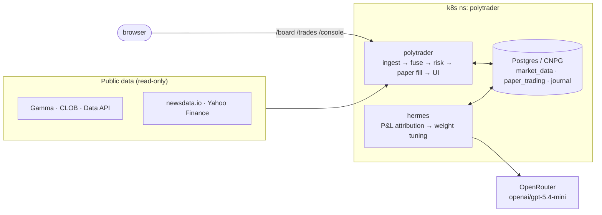

# polytrader

Autonomous, self-improving agent for **Polymarket** prediction markets — written in Rust (axum +
Dioxus), deployed on Kubernetes. It ingests live public market data, fuses multiple trading signals,
sizes positions with Kelly + risk gates, and trades **on paper** against real orderbooks. A separate
**Hermes** agent reflects on outcomes and tunes the strategy in a closed loop.

> **Trading mode: PAPER ONLY.** Real-order dispatch is structurally impossible in this build — only a
> fail-closed sender is wired, behind a proven + funded + operator-approved gate. See
> [wiki/decisions/real-order-approval-flow.md](wiki/decisions/real-order-approval-flow.md).

## Architecture at a glance



Full diagrams (decision loop, fusion brain, Hermes loop, fail-closed gate, data model):
**[wiki/architecture.md](wiki/architecture.md)**.

## How it works

1. **Ingest** — poll Gamma (markets + outcome prices) and CLOB (orderbooks) for a focused set of
   genuinely-uncertain, liquid markets (`POLYTRADER_BOOTSTRAP_MARKETS`); sports/World-Cup markets are
   arbitrage-only.
2. **Fuse** — every 5 min, each market is scored by five processors (orderbook momentum, spike
   divergence, volatility-guarded overreaction fade, plus advisory Yahoo/news sentiment). The
   `FusionEngine` combines them with Hermes-learned weights into a net edge after fees.
3. **Size & gate** — passing edges (≥4%) go through the `RiskManager`: quarter-Kelly sizing, position
   cap, per-market/total exposure caps, and a P&L floor.
4. **Simulate** — approved trades fill against the live orderbook in the paper engine; positions,
   fills, and portfolio snapshots are persisted. A mark-to-market snapshot each cycle feeds the live
   P&L chart.
5. **Settle & learn** — resolved markets realize P&L; Hermes attributes it per signal and nudges the
   fusion weights (clamped, gradual) so winners get more say over time.

## Components

- **polytrader** (main) — Rust (axum + Dioxus SSR). Ingestion, fusion, paper engine, decision loop,
  read-only real-balance, and the web UI (`/board`, `/trades`, `/console`).
- **hermes** — independent reflection agent: realized-P&L attribution, closed-loop weight tuning,
  optional LLM synthesis (OpenRouter `openai/gpt-5.4-mini`) with health surfaced as `llm_health`.
- **postgres** (CloudNativePG, 2 replicas) — schemas `market_data`, `paper_trading`, `journal`
  (append-only events). Money is always `rust_decimal::Decimal`.

## Web UI

| Route | What |
|-------|------|
| `/board` (default) | Market cards: probability bar, fused signal, news polarity, **held positions** (sorted first, live unrealized P&L) |
| `/trades` | Portfolio, **live P&L chart** (green up / red down), open positions, settlements, executions (filterable), AI health badge, real-trading readiness |
| `/console` | Original Dioxus dashboard |

## Build / test / deploy

```bash
cargo build && cargo test     # local
make k8s-deploy               # build images + apply manifests to the kind/k8s cluster
```

Runbooks: [wiki/runbooks/build-test-deploy.md](wiki/runbooks/build-test-deploy.md),
[wiki/runbooks/k8s-diagnostics.md](wiki/runbooks/k8s-diagnostics.md),
[wiki/runbooks/deploy-public-ngrok.md](wiki/runbooks/deploy-public-ngrok.md).

**Secrets** live only in `.env.local` (gitignored) and are projected into k8s Secrets — never committed.

## Documentation

- **[wiki/index.md](wiki/index.md)** — LLM-maintained knowledge base (concepts, decisions, strategies,
  runbooks, schema, integrations).
- **[wiki/architecture.md](wiki/architecture.md)** — architecture + Mermaid diagrams.
- **[docs/project-plan.md](docs/project-plan.md)** — roadmap.
- **[AGENTS.md](AGENTS.md)** — conventions for coding/Hermes agents.

## Links

- Polymarket: https://polymarket.com/ · API docs: https://docs.polymarket.com/
- Repo: https://github.com/simonellefsen/polytrader
