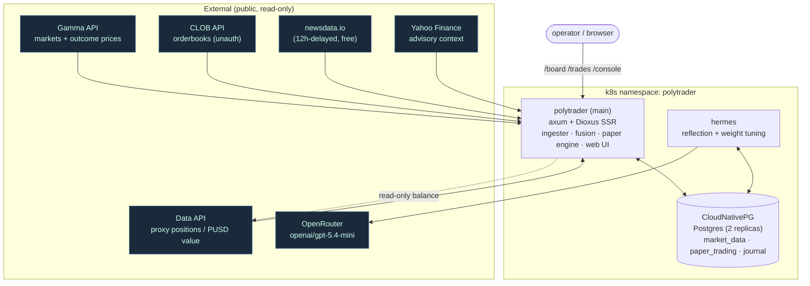
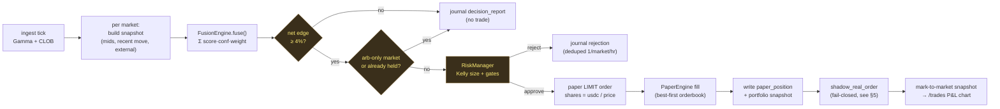
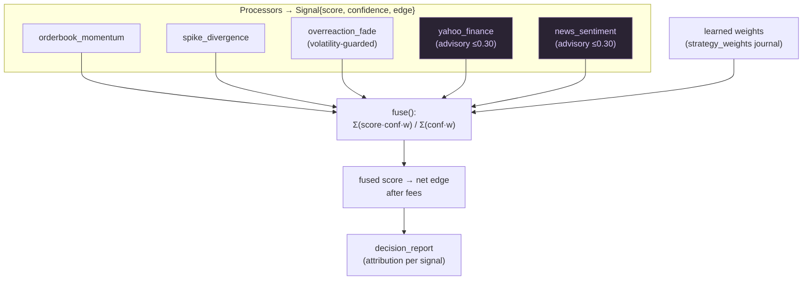
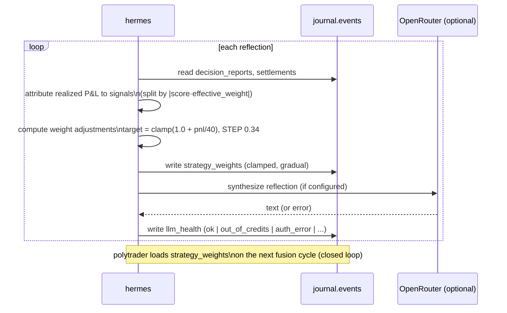
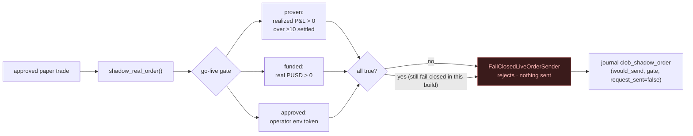
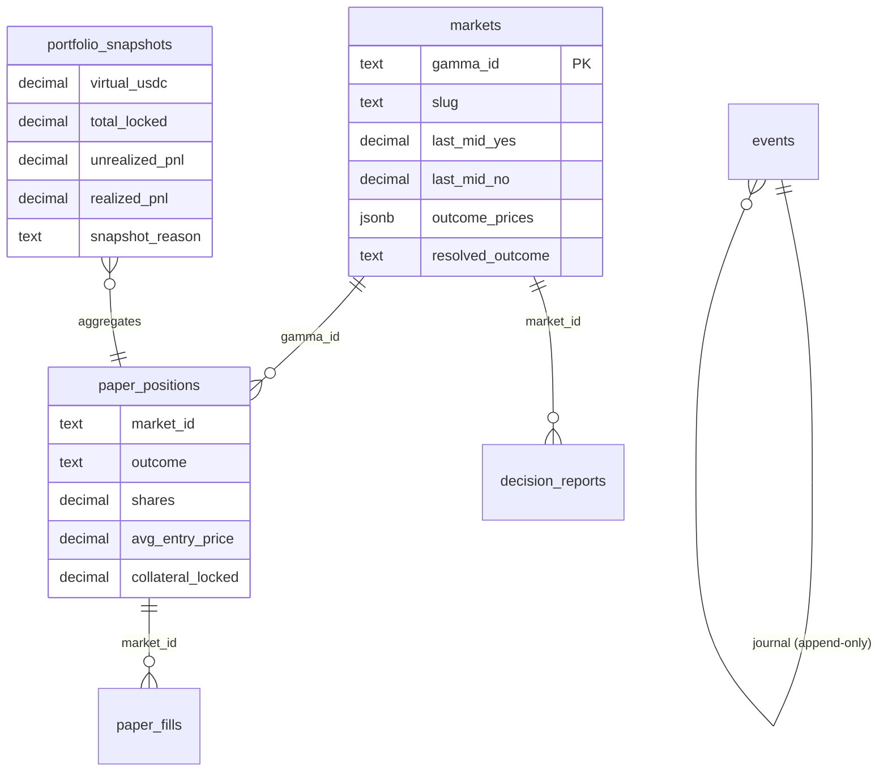

# Architecture

System architecture of polytrader: the live components, the autonomous decision→execution loop, the
multi-signal fusion brain, the Hermes learning loop, and the fail-closed real-order gate. All diagrams
are Mermaid (render on GitHub). Paper-only by default; real-order dispatch is structurally impossible
in this build (see [Real-order gate](#real-order-fail-closed-gate)).

Cross-references: [index.md](index.md) · [schema.md](schema.md) ·
[strategies/multi-signal-fusion.md](strategies/multi-signal-fusion.md) ·
[concepts/hermes-self-improvement.md](concepts/hermes-self-improvement.md) ·
[decisions/real-order-approval-flow.md](decisions/real-order-approval-flow.md).

## 1. System / deployment topology

Three long-lived workloads in the k8s namespace `polytrader`, plus public read-only data sources.

- **polytrader** ingests public market data, runs the fusion + risk pipeline every 5 min, simulates
  fills, serves the dashboards, and reads (never writes) the real PUSD proxy balance.
- **hermes** runs an independent reflection loop: attributes realized P&L to signals, tunes fusion
  weights (clamped, gradual), and optionally synthesizes notes via OpenRouter.
- **postgres** is the single source of truth — three schemas, see [schema.md](schema.md).

## 2. Autonomous decision → execution loop (every 5 min)

Risk defaults (see `src/risk/mod.rs`): quarter-Kelly, `max_position_usdc 20`, `max_market_exposure
0.20`, `max_total_exposure 0.80`, `min_net_edge 0.04`, `pnl_floor -0.20`. Widening the market set only
widens the funnel into this loop — every candidate still clears the same per-trade gates.

## 3. Multi-signal fusion brain

Each processor emits a `Signal`; the engine fuses them with per-processor **learned weights** (clamped
to `[0.25, 2.0]`) loaded from the latest `strategy_weights` journal event. `overreaction_fade` only
fires on extreme prices (>0.72 / <0.28) **and** a recent move ≥ 0.07 — otherwise the extreme is likely
correct and it stands down. Details: [strategies/multi-signal-fusion.md](strategies/multi-signal-fusion.md).

## 4. Hermes self-improvement loop

Profitable signals get up-weighted, losing ones down-weighted, gradually and within clamps. The
`llm_health` event surfaces on the /trades AI badge so a broken key or exhausted credits is visible at a
glance; Hermes falls back to local synthesis so reflections never stop. See
[concepts/hermes-self-improvement.md](concepts/hermes-self-improvement.md).

## 5. Real-order fail-closed gate

Only the `FailClosedLiveOrderSender` is wired — even if proven + funded + approved were all true, no
order is dispatched. The gate exists to **measure** distance to live readiness, surfaced on the /trades
readiness panel. Full rationale: [decisions/real-order-approval-flow.md](decisions/real-order-approval-flow.md).

## 6. Data model (high level)

Schemas: `market_data` (markets/orderbooks), `paper_trading` (positions/fills/snapshots), `journal`
(append-only events — decision_reports, settlements, strategy_weights, llm_health, clob_shadow_order,
real_account_balance). Money is always `rust_decimal::Decimal`, never floats. Full DDL + invariants:
[schema.md](schema.md).

## Surfaces (web UI)

- **`/board`** (default landing) — one card per market: probability bar, fused signal + fired chips,
  news polarity, resolution status, and **held positions** (sorted first, accent border, live
  unrealized P&L badge).
- **`/trades`** — portfolio cards, **live P&L chart** (green above water / red below), open positions
  with live marks, settlements, executions (filterable), AI health badge, real-trading readiness.
- **`/console`** — the original Dioxus SSR dashboard.

All three share the `Markets · Trades · Console` nav. Everything is read-only and paper-only.
